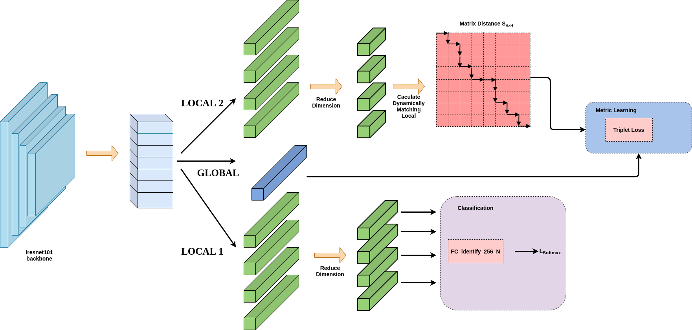
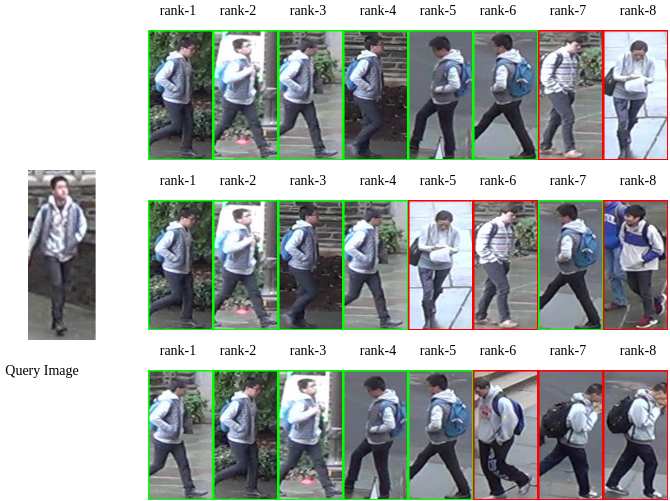

# Re-identification in Surveillance System
The reponsitory projects our thesis named "Re-identification in Surveillance System" and our paper "Multi-branch Network With Dynamically Matching Algorithm In Pre-identification" (Under review).

Multi-branch Network architecture. The features from the Iresnet-101 backbone is the input of three branches: Global branch, Local branch 1 and Local branch 2. All branches share weights from the backbone.
### Installation
```bash {.line-numbers}
git clone https://github.com/thang-dao/reid-surveillance-system.git
cd  reid-surveillance-system
pip install -r requirement.txt 
```
### Dataset 
Market1501-Dataset [Google](https://drive.google.com/file/d/0B8-rUzbwVRk0c054eEozWG9COHM/view?usp=sharing)
DukeMTMC-ReID [Google](https://drive.google.com/file/d/1jjE85dRCMOgRtvJ5RQV9-Afs-2_5dY3O/view?usp=sharing)
CUHK03-Reid (both detected and labeled) [Google](https://drive.google.com/file/d/0BxJeH3p7Ln48djNVVVJtUXh6bXc/view?usp=sharing) 

### Train
```bash {.line-numbers}
python train.py
```
### Test
```bash {.line-numbers}
python test.py
```
### Results

|model|dataset|method|mAP|Rank1|
|-----|-------|------|---|-----|
|iresnet101|Market-1501|local loss + global loss + softmax| 84.3| 93.6|
|iresnet101|DukeMTMC-reID|local loss + global loss + softmax| 86.0| 74.4|
|iresnet101|CUHK03-detected|local loss + global loss + softmax| 73.7| 70.8|
|iresnet101|CUHK03-labeled|local loss + global loss + softmax| 73.1| 76.3|

### Visualization 
Get visualized reID results, the results're saved in "results" folder:
```bash {.line-numbers}
python tool/get_vis_result.py
```
The results is ranked (query|rank1|rank2|...) and retrieved images have a green border, negative images have a red border like:



### ACKNOWLEDGEMENT
Thanks for public projects [person-reid-tiny-baseline](https://github.com/lulujianjie/person-reid-tiny-baseline) of [JackLu](https://github.com/lulujianjie)


